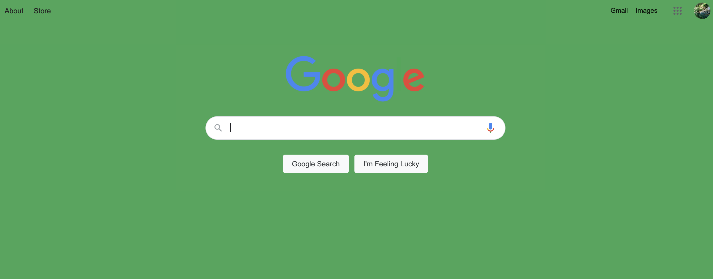

# Chrome Extension / React + Stripe

## What you built? 

I followed two tutorials. The first tutorial was on creating a simple Chrome extension that changed the background color of a chrome page. The second tutorial was a bit more involved: I created a small React application that included Stripe payment processing.

1) Chrome extension

2) Stripe + React

## Who Did What?

I worked alone.

## What you learned

1) Chrome Extensions

The tutorial was helpful in giving me a basic understanding of how small chrome extensions are created. Understandably, the tutorial was created for a very specific small use case, so I will need to do further research on how to build out more complex chrome extensions by looking at codebases of existing chrome extensions. For example, an interesting extension activity would be to emulate some of the functionality of Video Speed Controller, an extension I use quite frequently. 

2) React + Stripe

I decided to create a small application with React so I could focus primarily on the Stripe integration because I am already familiar with this React. Overall, the guide was fairly straightforward and broke down the code components very clearly (even a React beginner wouldn't have too much of a problem with this guide). One thing I did notice is there was a slight issue with page navigation (a deprecated version of a navigation component was being used), so in order to focus on just the Stripe integration, I eliminated the navigation aspect (as that was a problem more related to React).

Initially, I thought that integrating payment processing in a web application would be a daunting task, but it ended up being reasonably straightforward.

## Authors

Sanjana Goli

## Acknowledgments

1) Chrome extension: https://neilpatel.com/blog/chrome-extension/
2) React + Stripe: https://blog.logrocket.com/building-payments-system-react-stripe/
